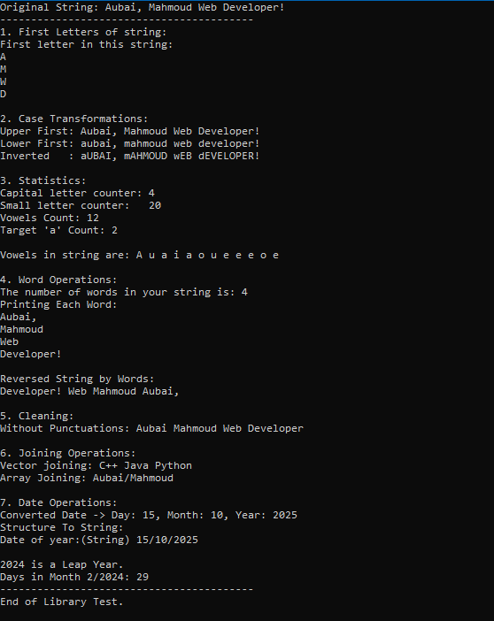

# StringMaster: C++ Advanced String Utility Library

**StringMaster** is a robust, object-oriented C++ library designed to simplify complex string manipulation tasks. It provides a comprehensive suite of tools for processing text, handling word-level operations, and performing data conversions (Strings to Date structures).

## 🚀 Features

The library is packed with useful methods, divided into categories:

### 1. Case Manipulation
- Upper/Lower first letter of each word.
- Invert all characters case (Upper <-> Lower).

### 2. Word & Letter Statistics
- Count words, capital letters, and small letters.
- Count occurrences of a specific character.
- Count and print vowels.

### 3. Advanced Word Processing
- Split strings into vectors based on custom delimiters.
- Reverse string by words (e.g., "Hello World" -> "World Hello").
- Print each word on a new line.

### 4. Cleaning & Formatting
- Remove all punctuations from a string.
- Join arrays or vectors of strings into a single string with custom separators.
- Replace words within a string.

### 5. Date Conversion Utilities
- Convert strings (DD/MM/YYYY) into `stDate` structures.
- Convert `stDate` structures back into formatted strings.
- Leap year checking and date validation.

## 📁 Project Structure

- `clsString.h`: The header file containing the class definition and `stDate` structure.
- `clsString.cpp`: The implementation file with the logic for all static and instance methods.
- `main.cpp`: A comprehensive test dashboard demonstrating the library's capabilities.

## 🛠 How to Use

1. Include the header in your project:
   ```cpp
   #include "clsString.h"
1.Create an object for instance-based operations:
```
clsString s1("Hello World");
cout << s1.InvertedLetters();
```
2.Use static methods for quick conversions:
```
stDate date = clsString::Convert_String_To_Structure("01/01/2024");
```
## 📸 Project Output (Demo)


💻 Technologies Used
C++ (Core logic)
OOP Principles (Encapsulation, Static/Instance methods)
STL (Vectors, Strings)
👤 Author
Aubai Mahmoud
Passionate Developer
